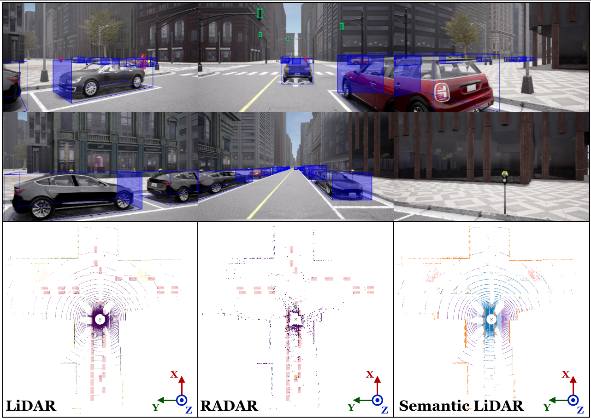
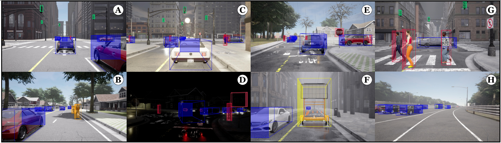

# 🚘 *CARLADrive* 🚘

The repository contains the code for generating and formatting the Dataset CARLADrive from the paper **CARLADrive: A Synthetic Multimodal Perception Dataset for Autonomous Driving** submitted to [ICRA 2026](https://2026.ieee-icra.org/).




---

## 📥 Download

The full standard version of the **CARLADrive Dataset** is (not yet) available for direct download:  

👉 [**Download CARLADrive Dataset (400 GB) (not working yet)**](https://link-to-your-dataset.com)  

Example download with `wget`:
```bash
wget -c https://link-to-your-dataset.com/carladrive_dataset.tar.gz
```

---

## 🚀 Getting Started

### CARLA Installation

To install CARLA Leaderboard 2.0 version, simply run:

```bash
cd pdm_lite
chmod +x setup_carla.sh
./setup_carla.sh
```

More details in [pdm_lite/README.md](pdm_lite/README.md).

### Docker Setup

Build the Docker image:

```bash
make build
```

Additionally, you can configure the following parameters of the image in the Makefile:

- `IMAGE_NAME`: Name of the generated Docker image.
- `TAG_NAME`: Tag of the generated Docker image.
- `USER_NAME`: Name of the user inside the Docker container.

Then, change PATH_TO_CARLADRIVE in the Makefile, according to your desired dataset path:

```
PATH_TO_CARLADRIVE := path/to/carladrive
```

Run the container:

```bash
make run
```

---

## ⚙️ Usage

🔧 **Environment Variables**

The `entrypoint.sh` sets CARLA-related variables. If you changed `USER_NAME` in the Makefile, update `CARLA_ROOT` and `WORK_DIR` in `.env`.

🧭 **Routes**

Set the desired route file in `pdm_lite/start_expert_local_base.sh`. The default set is located in `pdm_lite/leaderboard/data/`:

```bash
export ROUTES=/home/carladrive/workspace/pdm_lite/leaderboard/data/routes_training.xml
```

Additionally, change the save path for the data generated and the logs within the same file:

```bash
export PTH_LOG="/home/carladrive/Datasets/CARLADrive/CARLADrive_routes_test/routes_training"
export SAVE_PATH="/home/carladrive/Datasets/CARLADrive/CARLADrive_routes_test/routes_training"
```

📷 **Sensor Suite**

Modify the sensor suite or simulation parameters in `pdm_lite/team_code/config_nusc.py` (adapted from nuScenes).

🗂 **Data Generation**

Enable data saving by setting:

```bash
DATAGEN=1
```

in [start_expert_local_base](start_expert_local_base.sh). Otherwise, the simulation would run but no data would be stored. 

Then, launch CARLA in the host in a separate terminal:

```bash
cd pdm_lite/carla/CARLA_Leaderboard_20
./CarlaUE4.sh -carla-streaming-port=0 -carla-rpc-port=2000
```

Run the expert in the container:

```bash
cd $WORK_DIR
./start_expert_local_base.sh
```

This generates routes in `PATH_TO_CARLADRIVE` with the following structure:

```bash
  route_routeX/
  └──── bev_semantics/
  |      ├──── 0000.png
  |      └──── ...
  └──── boxes/
  |      ├──── 0000.json.gz
  |      └──── ...
  └──── measurements/
  |      ├──── 0000.json.gz
  |      └──── ...
  └──── CAM_BACK/
  |      ├──── 0000.jpg
  |      └──── ...
  └──── CAM_BACK_LEFT/
  └──── CAM_BACK_RIGHT/
  └──── CAM_FRONT/
  └──── CAM_FRONT_LEFT/
  └──── CAM_FRONT_RIGHT/
  └──── CAM_FRONT_INST/
  └──── lidar/
  |      ├──── 0000.laz
  |      └──── ...
  └──── lidar_semantic/
  └──── RADAR_BACK_LEFT/
  |      ├──── 0000.bin
  |      └──── ...
  └──── RADAR_BACK_RIGHT/
  └──── RADAR_FRONT/
  └──── RADAR_FRONT_LEFT/
  └──── RADAR_FRONT_RIGHT/
  └──── records.json.gz
  └──── results.json.gz

  route_routeX+1/
  └──── ...
```

🗂 **Data Formatting**

Format the dataset into a KITTI-like structure (≈1 minute per 3,000 samples).

```bash
python format_dataset.py -p /path/to/dataset
```

New folders and files per route:

```bash
  route_routeX/
  └──── labels/
  |      ├──── 0000.txt
  |      └──── ...
  └──── calib/
  |      ├──── 0000.txt
  |      └──── ...
  └──── points/         # For LiDAR point clouds.
  |      ├──── 0000.bin
  |      └──── ...
  └──── radar_points/   # For aggrupated RADAR point clouds.
  |      ├──── 0000.txt
  |      └──── ...
  └──── invalid_files.txt
```

- **`points/`**: LiDAR point clouds in `.bin` format.  
- **`radar_points/`**: radar point clouds in `.bin` format, obtained by grouping the 5 radars of the sensor suite with compensated velocities.  

This scripts also filters samples where the agent collides or is hit by another agent and include those samples in `invalid_files.txt` file, while registering the number of instances per class in `class_instances.txt`.

**Optional: 2D Bboxes**

Optionally, you can add 2D bboxes to the instances that appear in CAM_FRONT (this takes considerably more time and CAM_FRONT_INST is needed):

```bash
python extend_2d_bboxes.py -p /path/to/dataset
```

📑 **Annotations**

Each object instance is stored as:

```bash
<class> <width> <height> <length> <x> <y> <z> <yaw> <num_lidar_points> <speed_x> <speed_y>
```

- **Class Types**:  
  - `car`  
  - `walker`  
  - `bicycle`  
  - `stop_sign`  
  - `traffic_light`  
  - `static_trafficwarning`  
  - `weather` (general scene information, not an object instance)

- **Dimensions**: width, height, length.
- **Position**: (x, y, z) in ego frame (z = ground-relative).
- **Yaw**: rotation around Z axis.  
- **Num_lidar_points**: LiDAR hits on the object.  
- **Speed (x, y)**: available for `car`, `bicycle`, and `walker`.

If `extend_2d_bboxes.py` is used, the corner coordinates of bounding boxes are added to those instances in CAM_FRONT:

- **2D bbox coordinates**: u_min, v_min, u_max, v_max.

---

## 📊 Benchmarking with MMDetection3D

We provide a companion repository for benchmarking **CARLADrive** using popular 3D object detection models implemented in [MMDetection3D](https://github.com/open-mmlab/mmdetection3d).

👉 [**MMDetection3D_CARLADrive**](https://github.com/FabioskySG/MMDetection3D_CARLADrive)

This repository includes:
- Configuration files adapted for CARLADrive.  
- Training and evaluation pipelines.  
- Baseline results with LiDAR-, camera-, and fusion-based models.  

Use this repository if you want to **train and evaluate models on CARLADrive** and obtain metrics comparable to those reported in our paper.


## Contact

[
](https://orcid.org/0009-0004-8997-9012)

If you have any questions, feel free to contact me at [fabio.sanchezg@uah.es](mailto:fabio.sanchezg@uah.es).
